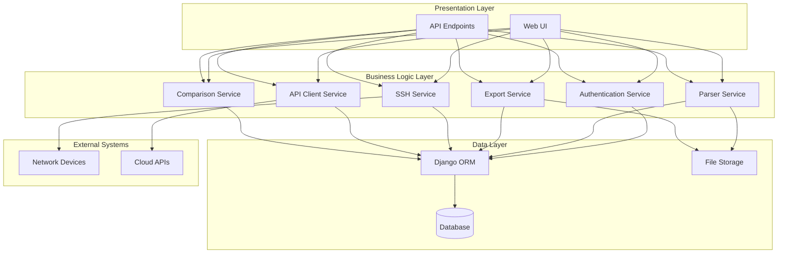
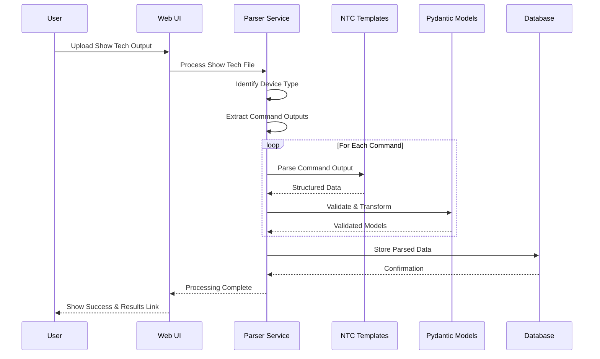
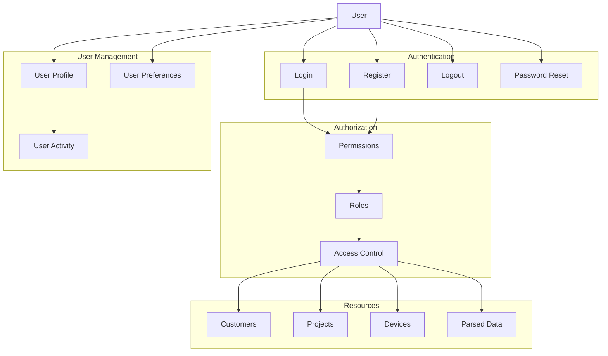
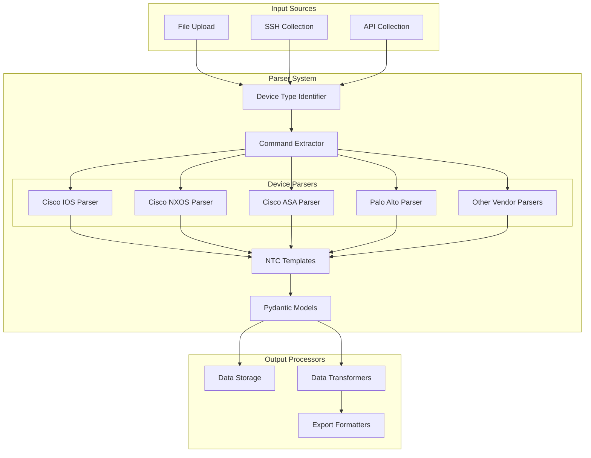
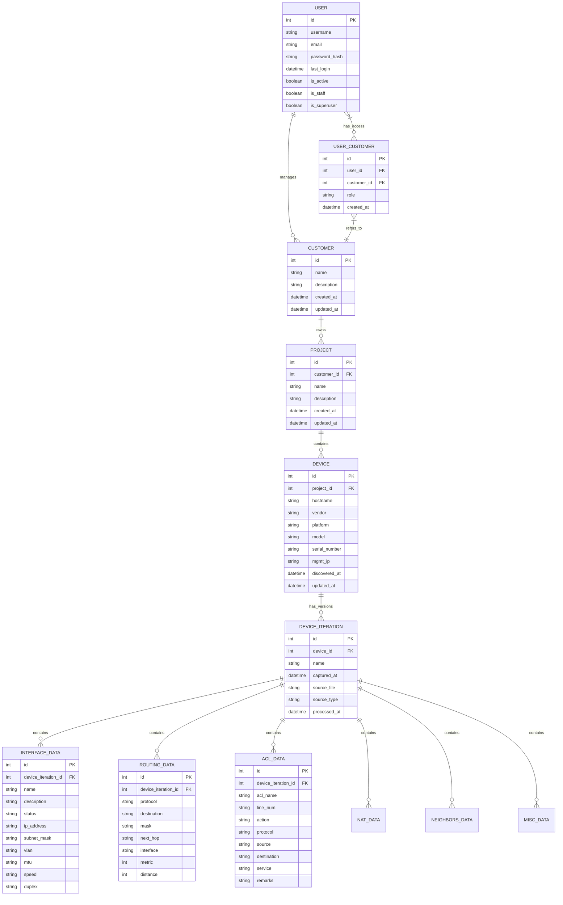
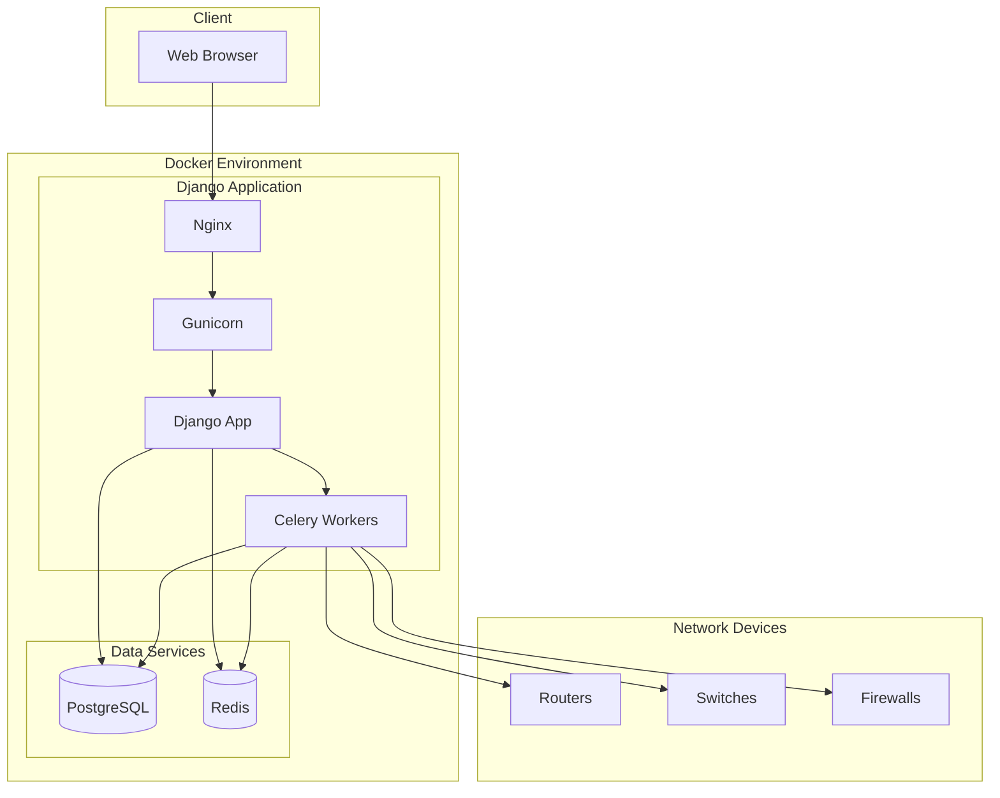

# System Architecture and Component Interaction Diagrams

This document contains Mermaid diagrams that illustrate the architecture and interactions between different components of the Network Configuration Parser application.

## System Architecture Overview

## Data Flow: Device Configuration Processing

## User Management and Authentication

## Parser Component Interaction

## Data Model Overview

## Deployment Architecture

