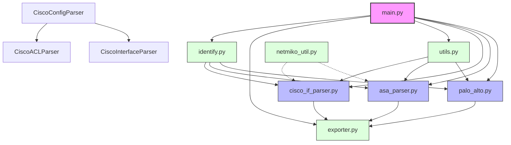

# Network Configuration Parser - Component Graph

```mermaid
graph TD
    %% Main Components
    Main[main.py] --> Identify[identify.py]
    Main --> Export[exporter.py]
    Main --> Utils[utils.py]
    
    %% Device-specific Parsers
    Main --> CiscoIF[cisco_if_parser.py]
    Main --> ASA[asa_parser.py]
    Main --> PaloAlto[palo_alto.py]
    
    %% Identify Module Interactions
    Identify --> CiscoIF
    Identify --> ASA
    Identify --> PaloAlto
    
    %% Parser Base Classes and Inheritance
    CiscoBase[CiscoConfigParser] --> CiscoACL[CiscoACLParser]
    CiscoBase --> CiscoInterface[CiscoInterfaceParser]
    
    %% Utility Usage
    Utils --> CiscoIF
    Utils --> ASA
    Utils --> PaloAlto
    
    %% Export Functionality
    CiscoIF --> Export
    ASA --> Export
    PaloAlto --> Export
    
    %% Optional Network Connection
    NetmikoUtil[netmiko_util.py] -.-> CiscoIF
    NetmikoUtil -.-> ASA
    
    %% Styling
    classDef primary fill:#f9f,stroke:#333,stroke-width:2px
    classDef secondary fill:#bbf,stroke:#333,stroke-width:1px
    classDef utility fill:#dfd,stroke:#333,stroke-width:1px
    
    class Main primary
    class CiscoIF,ASA,PaloAlto secondary
    class Utils,Export,Identify,NetmikoUtil utility
``` 