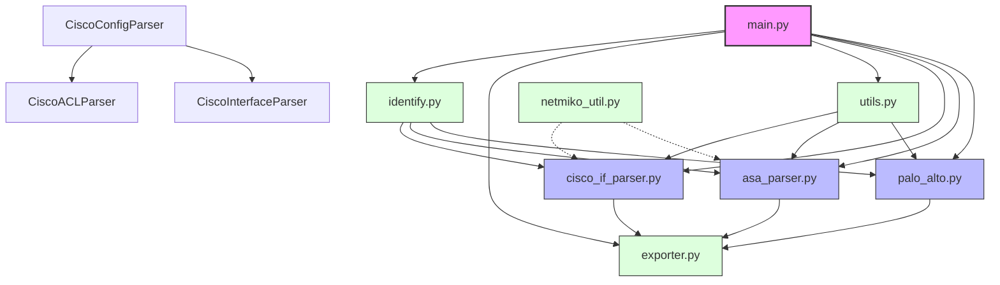

# Network Configuration Parser - Component Interaction Diagram

This document provides a visual representation of how the different components in the Network Configuration Parser application interact with each other.

## Overview

The Network Configuration Parser is a modular application designed to parse and analyze network device configurations from various vendors including Cisco IOS, Cisco ASA, and Palo Alto Networks devices. The application consists of several key components that work together to process configuration files and produce structured output.

## Component Interaction Diagram

## Component Descriptions

1. **main.py**
   - Central entry point for the application
   - Handles command-line arguments and user interaction
   - Orchestrates the parsing workflow
   - Manages file input/output operations

2. **identify.py**
   - Detects device type from configuration files
   - Routes parsing to appropriate device-specific parser
   - Supports multiple vendor formats

3. **Device-Specific Parsers**
   - **cisco_if_parser.py**: Handles Cisco IOS/NXOS configurations
   - **asa_parser.py**: Processes Cisco ASA configurations
   - **palo_alto.py**: Parses Palo Alto Networks configurations

4. **Utility Modules**
   - **utils.py**: Common network-related utility functions
   - **exporter.py**: Handles data export to Excel format
   - **netmiko_util.py**: Optional network device connectivity

## Flow Description

1. The user initiates the application through `main.py`
2. Configuration files are identified using `identify.py`
3. The appropriate parser is selected based on device type
4. Parsers process the configuration using utility functions
5. Parsed data is exported to Excel using `exporter.py`

## Key Features

- Modular design allows easy addition of new device types
- Common utilities shared across parsers
- Flexible export capabilities
- Optional direct device connectivity
- Comprehensive error handling and logging

## Notes

- Dotted lines indicate optional/conditional interactions
- Primary components are shown in pink
- Secondary (parser) components are shown in blue
- Utility components are shown in green 